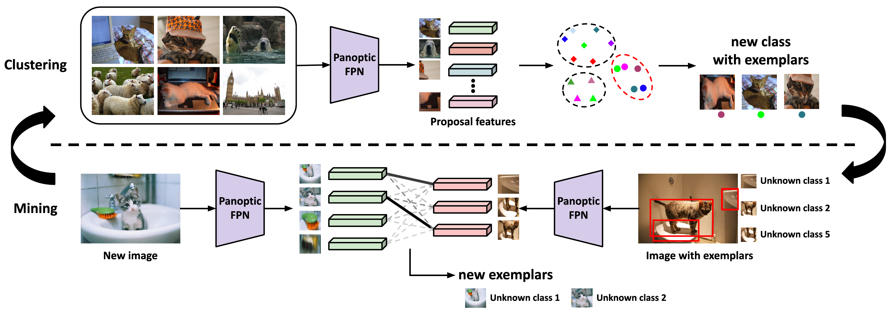
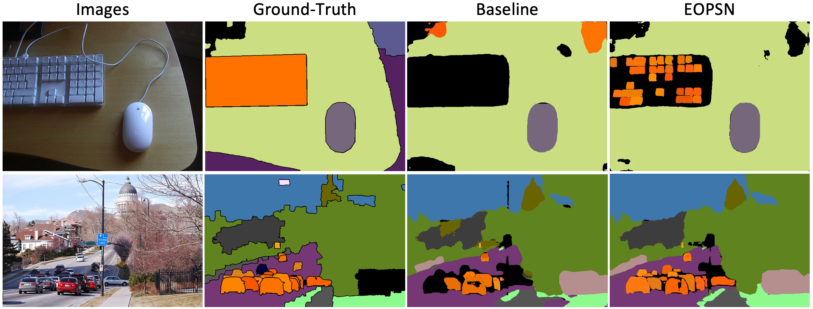
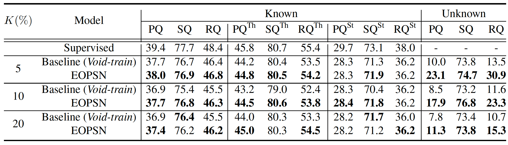

**EOPSN: Exemplar-Based Open-Set Panoptic Segmentation Network (CVPR 2021)**
========
Official PyTorch implementation for **[EOPSN](https://openaccess.thecvf.com/content/CVPR2021/html/Hwang_Exemplar-Based_Open-Set_Panoptic_Segmentation_Network_CVPR_2021_paper.html)**.

We propose open-set panoptic segmentation task and propose a new baseline called EOPSN.
The code is based on [Detectron2](https://github.com/facebookresearch/detectron2)

---

<p align="center">
  
</p>
<p align="center">
  
</p>

# Usage
First, install requirements.
```
pip install -r requirements.txt
```
Then, install PyTorch 1.5+ and torchvision 0.6+:
```
conda install -c pytorch pytorch torchvision
```

Finally, you need to install [Detectron2](https://github.com/facebookresearch/detectron2).
To prevent version conflict, I recommand to install via included `detectron2` folders.
Regarding installation issue caused from detectron2, please refer to [here](https://github.com/facebookresearch/detectron2/issues).
```
cd detectron2
pip install -e ./
```


## Data preparation

Download and extract COCO 2017 train and val images with annotations from
[http://cocodataset.org](http://cocodataset.org/#download).
We expect the directory structure to be the following:
```
datasets/coco
  annotations/  # annotation json files
  train2017/    # train images
  val2017/      # val images
```

To convert closed-set panoptic segmentation to open-set panoptic segmentation, run:
```
python prepare_unknown.py
```

The default setting is K=20, you can change [here](https://github.com/jd730/EOPSN/blob/master/prepare_unknown.py#L94).


## Training
To train EOPSN on a single node with 8 gpus for 30,000 iterations run:
```
python train_net.py --config configs/EOPSN_K20.yaml --num-gpus 8
```

Note that it requires pre-trained models (<i>Void-suppression</i>).
Please download from [Goolge Drive](https://drive.google.com/drive/folders/0Bx1p2kGSZijffno4eG1zWXFNbVpqUTJISVJSaDVZX2psR0pYQ3R4akZCaEZpX3BQVTNZMnc?resourcekey=0-69Rk3PxibLzMhqSXV4LYLA&usp=sharing).


To train baseline (train) on a single node with 8 gpus for 45,000 iterations run:
```
python train_net.py --config configs/baseline_K20.yaml --num-gpus 8
```

If you want to log using [WandB](https://www.wandb.com/), you can add `--wandb` flag.


## Evaluation
To evaluate EOPSN on COCO val5k with a single GPU run:
```
python train_net.py --config configs/EOPSN_K20.yaml --num-gpus 8 --resume --eval-only
```

<p align="center">
  
</p>


# Citations
```
@inproceedings{hwang2021exemplar,
    author = {Hwang, Jaedong and Oh, Seoung Wug and Lee, Joon-Young and Han, Bohyung},
    title = {Exemplar-Based Open-Set Panoptic Segmentation Network},
    booktitle = {CVPR},
    year = {2021},
}   
```

# License
EOPSN is released under the CC BY-NC-SA 4.0 license. Please see the [LICENSE](LICENSE) file for more information.
The [detectron2](detectron2) part is released under the Apache 2.0 license. Please see the [detectron2/LICENSE](detectron2/LICENSE) file for more information.

# Contributing
We actively welcome your pull requests!

